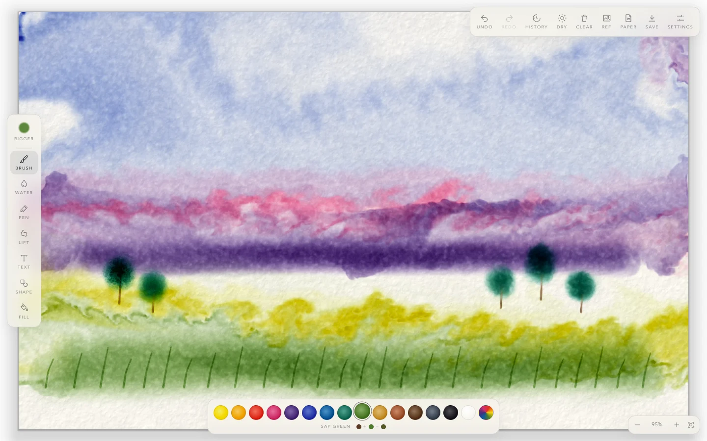
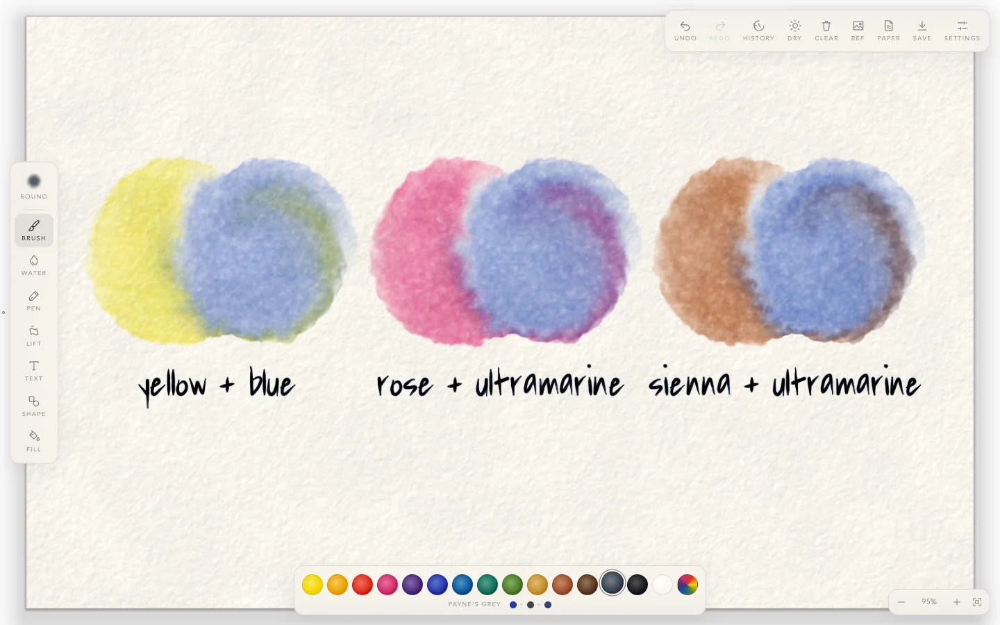
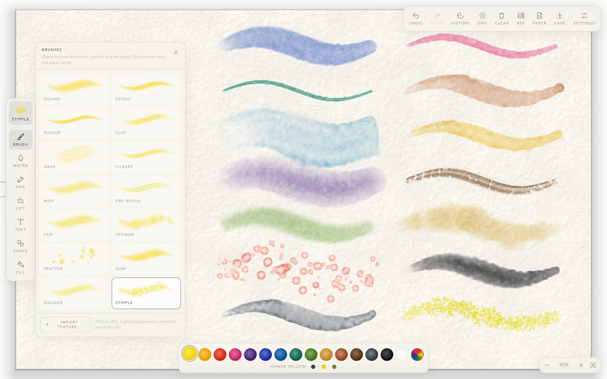
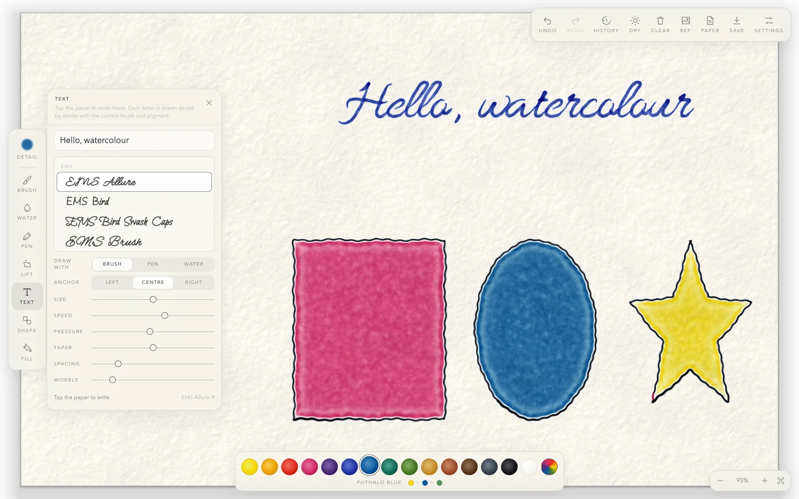

# Watercolor

A watercolour painting app that runs in your browser. Paint flows only where the paper is wet, colours mix the way real pigments do, and washes dry with soft blooms and dark tide lines.

**[Open the app →](https://msurguy.github.io/watercolor-playground/)** Nothing to install. Works with a mouse, a touchscreen or a stylus such as an Apple Pencil.



## What you can do

### Mix colours like real paint

Pigment is stored as a light spectrum rather than as RGB, so mixes work like paint does. Yellow and blue make green, rose and ultramarine make violet, and burnt sienna and ultramarine make a soft grey. Put a colour down while the paper is still wet and it bleeds into its neighbours. Paint it on dry paper and you get a hard edge.



### Choose from 14 brushes

Rounds, flats, a rigger, a hake, a mop, a fan, a dry brush, a sponge, spatter, stipple, sumi and more. Each brush has its own tip and its own way of handling water. A dry brush only touches the bumps of the paper, so its strokes break up. Flats and daggers follow the tilt of an Apple Pencil.

You can also turn any PNG or JPG into a brush: choose **Import texture…** in the brush library, or drop an image onto the page.



### Write text, draw shapes, fill areas

- **Text (T).** Type a line and tap the paper. The brush writes each letter stroke by stroke, using single-line plotter fonts.
- **Shape (G).** Drag to draw a line, an arrow, a rectangle, an ellipse, a triangle, a polygon or a star. You can also trace your own SVG file.
- **Fill (K).** Tap an area and a wash spreads out from that spot to fill it, pooling and drying like a hand-painted wash.



### And more

- **Water, Pen, Lift and Dry.** Wet the paper and push paint around with clear water. Draw ink lines that feather into wet areas. Blot wet paint off with a tissue. Flash-dry the sheet so you can glaze new colour over it.
- **Paper.** Ten paper types, including cold press, hot press, rough, khadi, washi and kraft, at sizes from postcard to 2400 × 1600.
- **Reference image.** Put a photo or a sketch under the paint and trace over it. iPhone HEIC photos work too.
- **History.** Undo and redo any step, or jump straight to an earlier step in the History panel.
- **Save.** Export a PNG, JPEG or WebP with a transparent, white or paper background. Save a project file (`.wcp`) to keep the wet paint and carry on later.
- **Hand painting.** Turn on **Settings → Hand** and paint in front of your webcam. Pinch to paint, and rest your hand on a button to press it.

## How to paint

1. Pick a pigment from the palette at the bottom and a brush from the top of the left toolbar.
2. Paint with the **Brush** (B). While the paint is wet, add a second colour next to it and watch them mix.
3. Use **Water** (W) to soften edges or move wet paint around.
4. Press **Dry** (D) when you want to glaze over a layer without disturbing it.
5. Press **Save** (S) to download your painting.

With a stylus, pressure changes the stroke. The barrel button switches to water and the eraser end lifts paint. On an iPad, once you have used an Apple Pencil, your finger becomes the water brush.

### Keyboard shortcuts

| Key | Action |
| --- | --- |
| **B** / **W** / **P** / **L** | Brush / Water / Pen / Lift |
| **T** / **G** / **K** | Text / Shape / Fill |
| **D** | Dry the paper |
| **1–9**, **0** | Choose a pigment (**0** is white gouache) |
| **,** / **.** | Previous / next brush |
| **[** / **]** | Smaller / larger brush |
| **⌘Z** / **⇧⌘Z** | Undo / redo |
| **+** / **−**, **⇧1** | Zoom in / out, fit to screen |
| **R** | Show or hide the reference image |
| **S** | Save the image with your last export settings |
| **⌘S** / **⌘O** | Save / open a project file |
| **F** | Fullscreen |
| **Esc** | Close a panel or stop drawing |

On Windows and Linux, use Ctrl instead of ⌘.

## Run it yourself

You need [Node.js](https://nodejs.org/) 20 or newer.

```bash
git clone https://github.com/msurguy/watercolor-playground.git
cd watercolor-playground
npm install
npm run dev      # opens at http://localhost:5173
npm run build    # builds a static site into dist/
```

Every push to `main` deploys to GitHub Pages through [.github/workflows/deploy.yml](.github/workflows/deploy.yml).

## How it works

The app is TypeScript and WebGL2, with a [Preact](https://preactjs.com/) interface. The simulation and the rendering don't depend on the UI.

<details>
<summary><strong>Colour mixing</strong></summary>

Each colour is stored as a **spectrum**, not as RGB:

1. A picked colour is turned into a 38-band reflectance curve (the [spectral.js](https://github.com/rvanwijnen/spectral.js) method), then into absorbance `A(λ) = −ln R(λ)`.
2. `A(λ)` is compressed to 7 numbers using a basis fitted offline over the sRGB gamut ([src/engine/spectralData.ts](src/engine/spectralData.ts)). Absorbance adds up linearly with concentration, so the fluid simulation can add, move and spread these numbers and the mix still comes out subtractive (Beer–Lambert, the transparent-glaze model that suits watercolour).
3. The display shader rebuilds the spectrum at 16 wavelengths, applies `exp(−A)` and converts the result to sRGB.

Compared with the full 38-band model, the average colour error is about 0.1–0.2 ΔE_OK (×100 scale), far below the ~2 a person can see. The 7 coefficients plus white-gouache coverage fit exactly in two RGBA16F textures.

</details>

<details>
<summary><strong>The water simulation</strong></summary>

The fluid model is adapted from [inkwash](https://github.com/johnowhitaker/inkwash): a GPU grid for velocity, pressure and vorticity, a wetness field that keeps the flow on wet paper, and pigment that settles ("fixes") into the paper.

| Layer | Format | Purpose |
| --- | --- | --- |
| velocity, pressure | RG16F / R16F, 256 px on the short side | how the water flows |
| wet | R16F, full resolution | standing water, which dries over time |
| ink | 2× RGBA16F | pigment that can still move |
| fixed | 2× RGBA16F | pigment settled into the paper |
| paper | RGBA8 | the paper texture, generated once |

Pigment moves between neighbouring pixels only as far as the water on both sides allows. That conserves pigment and keeps it off dry paper, so wet-on-dry strokes get hard edges and wet-in-wet strokes bloom as far as the water reaches. Pigment is also pulled toward the drying edge of a wash and left there, which makes the dark tide line.

</details>

<details>
<summary><strong>Performance</strong></summary>

- Only the wet part of the sheet is simulated, and only the changed part of the screen is redrawn.
- Once everything is dry, the simulation stops, so an idle painting uses no GPU time.
- Undo copies each 128 px tile only the first time a step changes it, so memory stays bounded. The oldest steps are dropped first.
- The sheet is capped at 2048 × 1536 pixels.

</details>

<details>
<summary><strong>Code layout</strong></summary>

| Folder | What's inside |
| --- | --- |
| [src/engine/](src/engine/) | WebGL2 simulation and renderer, brushes, papers, spectral colour, undo history |
| [src/app/](src/app/) | App state (`store.ts`), the tool list (`registry.ts`), keyboard shortcuts |
| [src/components/](src/components/) | Toolbar, palette, brush library, panels, overlays |
| [src/ui/](src/ui/) | Shared building blocks: panels, sliders, icons |
| [src/text/](src/text/), [src/shapes/](src/shapes/), [src/fill/](src/fill/) | The Text, Shape and Fill tools |
| [src/draw/](src/draw/) | Draws text and shape paths as real brush strokes |
| [src/reference/](src/reference/), [src/export/](src/export/), [src/project/](src/project/) | Reference image, image export, `.wcp` project files |
| [src/hand/](src/hand/) | Hand tracking with MediaPipe |

**To add a tool**, create a folder like `src/fill/` with a store class that implements `PanelTool` and a `*Panel.tsx` component, then add one entry to [src/app/registry.ts](src/app/registry.ts).

In development, `window.app` and `window.engine` are available in the browser console for scripting.

</details>

## Credits

- [inkwash](https://github.com/johnowhitaker/inkwash) by Jonathan Whitaker, for the GPU fluid simulation.
- [spectral.js](https://github.com/rvanwijnen/spectral.js), for the spectral colour data.
- Single-line fonts (Hershey, EMS, Relief and others) from [drawingbots.net](https://drawingbots.net).
- [vpype-js](https://github.com/plottertools/vpype-js) for SVG import, [q-floodfill](https://github.com/pavelkukov/q-floodfill) for the fill tool, [heic-to](https://github.com/hoppergee/heic-to) for iPhone photos and [MediaPipe](https://ai.google.dev/edge/mediapipe) for hand tracking.
